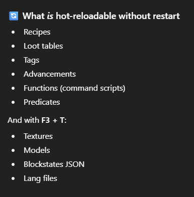

# Technical things to do
- Add resource by right clicking?
- Logical fuel resource
- Food item
- Custom tool
- Block drops with specific tool
- Custom direction block (log)
- Block states

# Ideas
## Fizzle Block
- Lil tube in box
  - Custom model
  - Base square outside
  - Inside tube - similar to piston
- Create from basic resources (non mod based)
- Add resources to it - Block Entity
  - When has enough, changes visual on block (outside ring pops up?)
- Pop down steps until primed - Block state
  - Plays sound on each push down (pitch increased based on distance)
  - Right click with specific resource - Flint?
- is "Primed" once it's fully down
- Based on where fizzle block based on top of, influences how good the drops/fizzle will be
- UI can display fizzle strength
- Powers up then pop
  - Side flaps were vertical pop down like clamps
  - Explodes
  - Drops a few items - Fuel - Fizzle Powder
  - Throws blocks that are a fizzle substance as blocks

## Fizzle substance
- If broken within tool drops fizzle powder
- With the proper tool, gives the real material, Fizzle Substance
- Burn substance? use powder to burn?

## Other
- Block that talks to you
- Make custom dimension
- Make dash like ability
- Make wings
- ... Plane? :P
- Rollercoaster tycoon
- Make a robot farming
- Apple juice
- Connection based logic blocks
    - Apple juice in pipes
    - Robot Farming apple trees
    - Juicer at end of pipes
- Civilians can do activities that you sell
- Sad ghast (runs into corners and cries)
- Sniffler - hoover snout and sniffs up blocks and poops out compressed sniffle blocks

# Notes
### Refreshing:

# Resources
- [Craft Recipe Creator](https://crafting.thedestruc7i0n.ca/)
- [Root mod tutorial](https://wiki.fabricmc.net/tutorial:start#creating_your_first_mod)
- [Fabric docs Tutorial item](https://docs.fabricmc.net/develop/items/first-item)
- [White mode item tutorial](https://wiki.fabricmc.net/tutorial:items)
- [Recipe Json format wiki](https://minecraft.wiki/w/Recipe#JSON_Format)
- [Github recipes examples layout](https://github.com/skylinerw/guides/blob/master/java/recipes.md#groups)